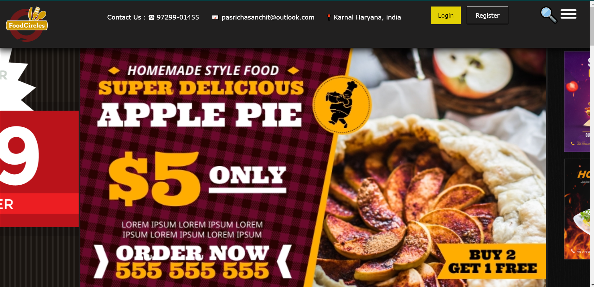
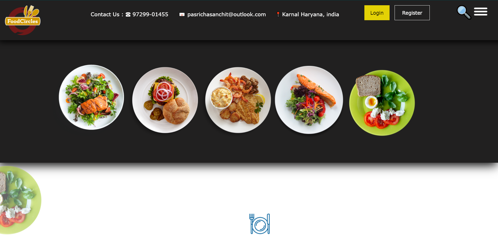
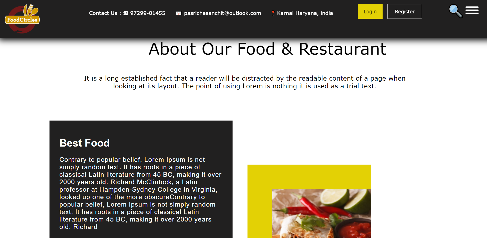
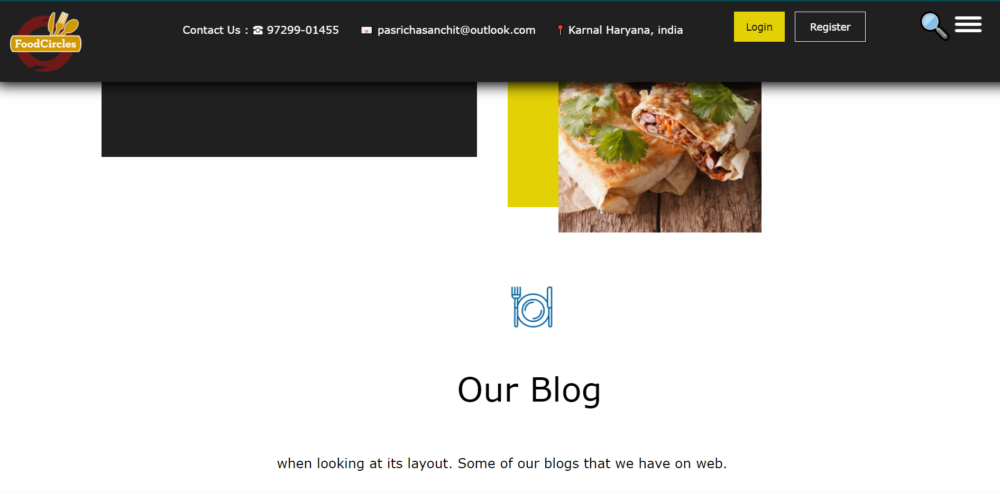
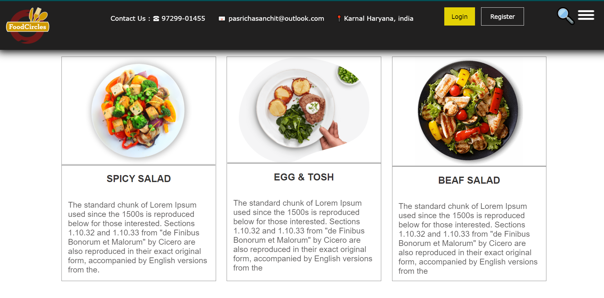
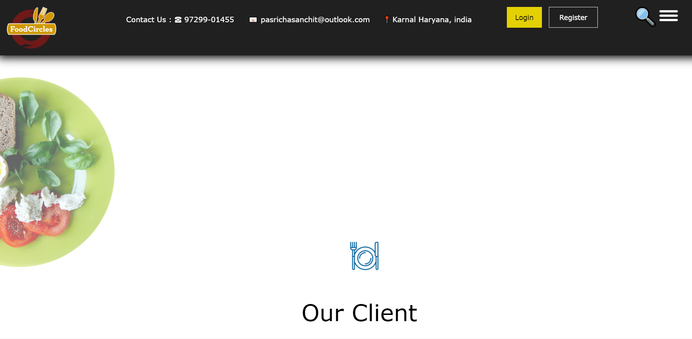
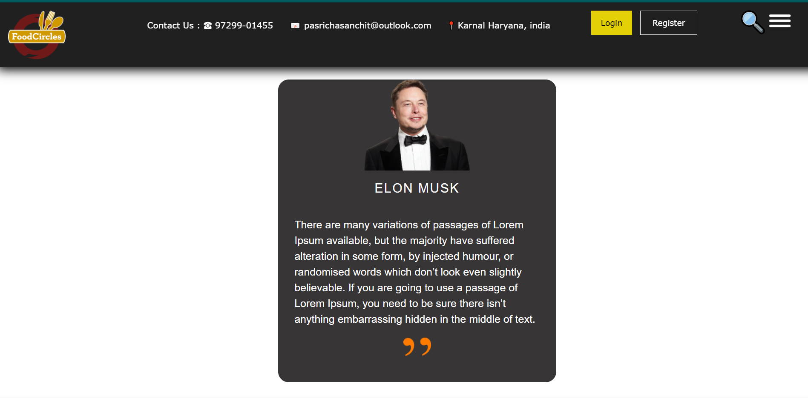
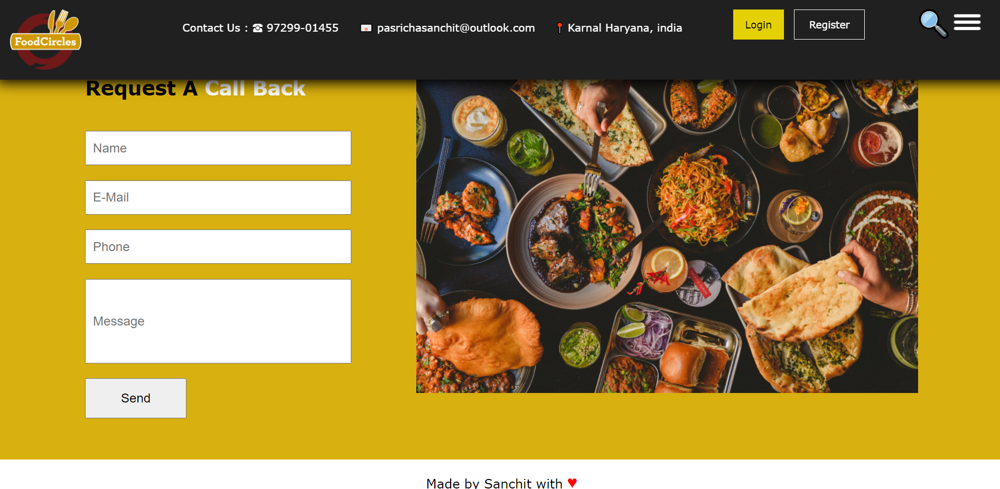

# Static_food_website
This is a static food webpage made using CSS and HTML. In this the banners are enclosed in marquee, dishes images, About section, blog post shortcuts, contact form and love. The actual idea is taken from a webpage named spicyo and tried to make this look a like. Please have a look pasted below screenshots and code is present in repo. 

